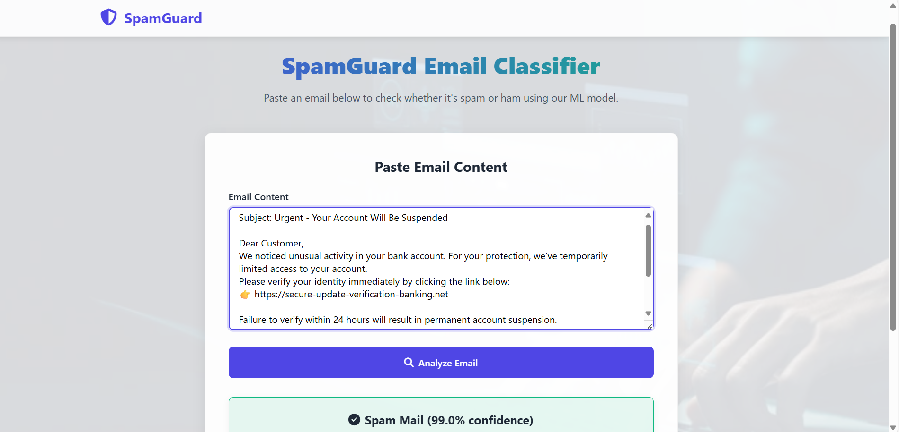
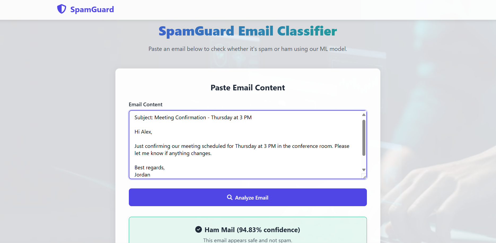

# 📧 SpamGuard

**SpamGuard** is a Flask-based web application that classifies emails as **Spam** or **Ham (Not Spam)** using a trained machine learning model. It also performs **phishing keyword analysis** to enhance prediction reliability.

 

## 🚀 Features

- 🔍 Email classification (Spam vs Ham)
- 🧠 ML-powered prediction using Scikit-learn
- 🔐 Phishing keyword detector
- 🌐 Clean, responsive UI with HTML/CSS
- 🧪 Lightweight, fast, and secure

 

## 🛠️ Tech Stack

- **Frontend**: HTML5, CSS3, JavaScript
- **Backend**: Python, Flask
- **ML**: Scikit-learn, Natural Language Toolkit (NLTK)
- **Deployment**: Flask built-in server (or deploy to Heroku, Render, etc.)

 

## 🧪 Model Training Steps

1. **Dataset**: Used the mail_data.csv
2. **Text Cleaning**:
   - Lowercasing
   - Removing stopwords and punctuation
   - Tokenization and stemming using `nltk`
3. **Feature Extraction**: TF-IDF vectorizer
4. **Model**: Multinomial Naive Bayes classifier from `sklearn`
5. **Evaluation**: Achieved ~98% accuracy on test data
6. **Exported Model**: Saved using `joblib` to `model/spam_classifier.pkl`

> For reproducibility, see `train_model.py`.

 

## 🖥️ Preview - Example Predictions

### 🛑 Spam Mail Detected

### ✅ Ham Mail Detected

 

## 📂 Project Structure

spamguard-app/
├── static/
│   └── assets/
│       └── image1.webp
├── templates/
│   ├── index.html
│   ├── result.html
├── model/
│   └── spam\_classifier.pkl
├── train\_model.py
├── app.py
├── requirements.txt
└── README.md

 

## 🧪 Run Locally

1. **Clone the repo**
   
   git clone https://github.com/mahnoorimran563/spamguard-app.git
   cd spamguard-app

2. **Create virtual environment (optional but recommended)**

   python -m venv venv
   source venv/bin/activate  # On Windows: venv\Scripts\activate

3. **Install dependencies**

   pip install -r requirements.txt

4. **Run the Flask app**

   python app.py
   

6. **Open in browser**

   http://localhost:5000

 

## 🔒 License

This project is licensed under the [MIT License](LICENSE).

 

## 🙋‍♀️ Author

**Mahnoor Imran**
💼 [LinkedIn](https://www.linkedin.com/in/mahnoorimran563)
📧 [mahnoorimran563@gmail.com](mailto:mahnoorimran563@gmail.com)

---

**Made with 💻 and ☕ by Mahnoor**

